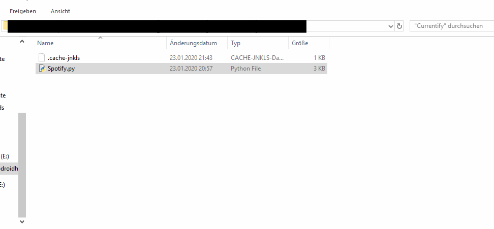

# Currentify
Add the current playing Song in Spotify to your playlist over Python :)

# Requirements
* Python Modules: https://github.com/plamere/spotipy
* Create your own APP on Spotify

# Installation
1. Install PIP&Python
2. Install Spotipy `pip install Spotipy`
3. Edit the Spotify.py at Line 11 and 12 with your Client ID and your Secret.
4. Open a Bash/Shell/Terminal
5. In the Bash, go to your Clone Directory and type `python Spotify.py`
6. Or Maybe This way 

# Notes
Useful Links:
* https://developer.spotify.com/documentation/general/guides/app-settings/
* https://developer.spotify.com/documentation/general/guides/scopes/
